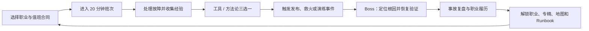
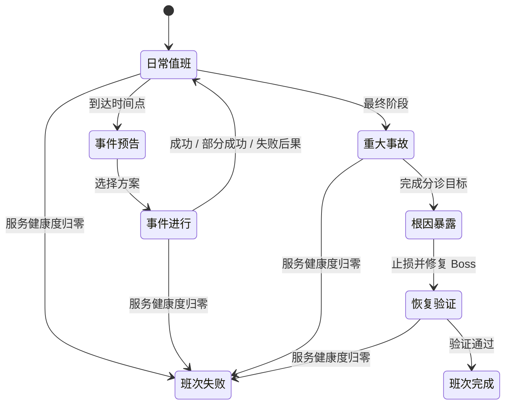

# iT-BATTLE：值班幸存者

> 游戏框架讨论稿 v0.3  
> 日期：2026-07-19  
> 状态：用于确认产品方向，不代表最终内容范围

已确认的产品规则：

- 同事与跨部门角色采用“压力投影 → 化解矛盾 → 转化盟友”机制，不作为可直接消灭的普通敌人。
- 视觉采用原创的“高俯视故障潮”：拉高镜头、增加同屏怪量，以清晰像素标签和独立轮廓表现 `404 / 502 / OOM / Deadlock` 等故障；2D 为正式基线，浅层 2.5D 仅作可选增强。

## 0. 先给结论

这是一个很适合用 Godot 制作的项目。

- 类型：单人高俯视角 Survivor-like，自动攻击、局内构筑、局外职业解锁；规则层保持 2D，视觉层优先保证大规模单位与故障标签可读性。
- 一局：建议 18—20 分钟，原型先做 5—8 分钟。
- 初始角色：运维工程师，一个什么都能学、但没有极端专精的通才。
- 角色结构：核心职业、职业专精、跨职业称号三层，既能覆盖大量真实岗位，又避免角色换皮。
- 战斗主体：技术故障、告警、工单和流程压力；HR、财务、产品、开发、领导、客户等以“压力投影”、事件发起者或 Boss 机制出现。
- 叙事原则：处理的是事故与协作问题，不是真的殴打同事；完成事件后，跨部门角色还可以转化为支援 NPC。
- 技术建议：Godot 4.7.1 Standard、静态类型 GDScript、2D 规则与渲染解耦；M0 先完成 2D Compatibility 基线，PC 再评估浅层 2.5D 或 Forward+ 增强。
- 首发平台：Windows、macOS、Linux 与 Steam Deck；移动版第二阶段；Web 做降配试玩；传统主机不进入 MVP。

一句话卖点：

> 你要在一场 20 分钟的深夜值班里，用脚本、监控、回滚、自动化和一点点错误预算，扛过需求变更、告警风暴与零号事故，并从通才运维成长为几十种专业方向。

## 1. 产品定位

### 1.1 核心体验

玩家移动与走位，工具自动工作；升级时在三个选项中构筑“工具 + 方法论 + 职业机制”；固定时间出现发布、救火、备份恢复等事故事件，最终完成恢复验证并生成事故复盘。

体验关键词：

- 爽：大量告警和故障被批量闭环。
- 懂行：运维玩家能认出真实概念，但不要求普通玩家先懂术语。
- 有构筑：同一职业可以走完全不同的工具链。
- 有事故感：不只是原地割草，还要做止损、定位、回滚和验证。
- 有职场幽默：一本正经地描述荒诞现场，不做部门仇恨模拟器。

### 1.2 五个设计支柱

1. **低门槛操作**：移动、交互、一个应急技能；攻击默认自动完成。
2. **高辨识职业**：每个核心职业拥有自己的资源、节奏或空间机制。
3. **数据驱动内容**：职业、敌人、波次、事件和进化尽量通过数据组合。
4. **组合产生难度**：敌人行为互相配合，而不是后期只堆血量与伤害。
5. **系统性讽刺**：讽刺坏流程、模糊责任与信息差，不把任何岗位写成天生反派。

## 2. 核心循环



### 2.1 一局内的资源

| 资源 | 层级 | 游戏作用 | 主题包装 |
|---|---|---|---|
| 服务健康度 | 全局常驻 | 玩家生命值，归零即形成重大事故 | 当前服务状态 |
| 经验 | 全局常驻 | 升级三选一 | 有效日志 / 处置经验 |
| 变更预算 | 全局常驻，M2 后引入 | 商店和事件决策 | 本班次可支配预算 |
| 错误预算 | SRE 职业专属 | 换取爆发或容错 | SLO 风险空间 |
| 咖啡 | 一次性掉落物 | 免费刷新一次选项 | 重新整理思路 |
| 根因线索 | 事故临时计量条 | 在当前事故中暴露根因 | 日志、指标、链路关联 |

“过劳”和“咖啡续命”只能作为笑点，不能成为唯一正确玩法。调休、轮班、自动化、拒绝不合理变更也必须是强力能力。

这些资源不能在第一版同时出现。M1 只使用服务健康度和经验，并在事故阶段临时显示根因线索；变更预算、咖啡和错误预算在对应系统或职业真正进入版本时再引入。

### 2.2 建议的 20 分钟节奏

| 时间 | 内容 |
|---|---|
| 0:00—2:30 | 日常工单与基础故障，建立第一套工具链 |
| 2:30 | 第一次事件选择，确定本局倾向 |
| 3:00—6:00 | 加入远程、分裂、复活、积压等行为 |
| 6:00 | 第一只精英或小型发布事件 |
| 6:00—10:00 | 技术故障与流程压力开始组合 |
| 10:00 | 维护窗口小 Boss，奖励一次 Runbook 强化 |
| 10:30—14:00 | 地图机制介入：锁表区、断电区、隔离区等 |
| 14:00 | 大型事件：止损、根治或接受风险 |
| 15:00—18:00 | 事故级联，复用并组合前面学过的机制 |
| 18:00—20:00 | 最终 Boss、恢复验证与结算 |

击败 Boss 但没有完成恢复验证，只获得部分结算。这样“打死大怪”不等于“系统真的恢复”。

### 2.3 局内状态机与失败规则



- 角色不是肉身血条，而是玩家在“值班战场”中的处置焦点；漏过来的故障、超时工单和攻击会损害服务健康度。
- 日常值班和事件都持续刷怪。事件开始时只在选择方案时暂停，进入事件后由事件导演替换一部分波次并加入目标。
- 交互节点允许短暂引导，移动即可取消且进度保留；不能用长时间站桩强迫玩家吃伤害。
- 普通事件失败不会直接结束班次，只会扣健康度、增加技术债或强化后续波次。
- 最终 Boss 的最后阶段就是恢复验证；不会在胜利后再安排一段没有新决策的收尾劳动。
- 全局唯一失败条件是服务健康度归零。限时事件到期只产生定义好的后果。

## 3. 操作与构筑

### 3.1 输入

- 移动：WASD、方向键、左摇杆或虚拟摇杆。
- 自动工具：按规则自动索敌与攻击。
- 交互：处理终端、占领节点、选择发布/暂停/回滚。
- P1 响应：每个职业一个长冷却主动技能，也可在设置中开启自动释放。
- 暂停与详情：随时查看技能说明、事件目标和当前构筑。

不建议 MVP 同时加入手动瞄准、翻滚、多个主动技能和复杂连招；这些会破坏移动端兼容性，也会掩盖职业与事件系统是否真的好玩。

### 3.2 一套构筑的组成

- 最多 5 个“工具”：相当于武器。
- 最多 5 个“方法论”：相当于被动能力。
- 1 个职业资源与职业被动。
- 1 个 P1 响应技能。
- 局内 3 次职业专精选择。
- 工具满级并满足对应方法论后，进化为“自动化方案”。

### 3.3 代表性进化配方

| 工具 | 方法论 | 自动化进化 |
|---|---|---|
| Bash 脚本 | 幂等性 | 基础设施即代码 |
| SQL 查询 | 索引意识 | 查询优化器 |
| Ping 扫描 | 带宽扩容 | 路由收敛风暴 |
| 防火墙规则 | 零信任 | 微隔离矩阵 |
| 日志采集器 | 关联分析 | 分布式追踪 |
| 工单投递器 | 知识库 | 自助服务门户 |
| 补丁包 | 标准化 | 全网灰度推送 |
| Pipeline Runner | 测试覆盖率 | GitOps 金丝雀发布 |
| Pager | Runbook | 自动修复系统 |
| Pod 群 | 期望状态 | 无限副本控制器 |
| 快照磁带 | 多副本 | 不可变备份 |
| GPU Kernel | 液冷散热 | Tensor Storm |
| 部署包 | 回滚预案 | 蓝绿割接 |
| 云实例 | 成本治理 | Spot Fleet |
| 远程代理 | CMDB | 全终端编排 |

所有职业都可以拿到大部分公共工具，但对本领域工具拥有亲和力。这允许“DBA 拿防火墙”“Helpdesk 玩 Kubernetes”这类非标准构筑，同时保留职业辨识度。

## 4. 职业体系

### 4.1 三层模型

**核心职业**必须具备独立战斗循环：一种职业资源、一个初始工具、一个职业被动、一个 P1 响应和若干改变玩法的专精。

**细分专精**用于表达真实岗位颗粒度。它改变初始工具、资源规则或事件优势，但不必为每个细分岗位复制一整套角色。

**跨职业称号**由两个或多个履历共同解锁，表达混合能力，而不是现实岗位的高低关系。称号不是一名新的完整角色；玩家仍选择一个核心职业，称号只追加一条规则、一个起始工具或一组跨领域联动。

例如：

- DBA + SRE → DBRE。
- 网络 + 运维开发 → NetDevOps。
- 安全 + DevOps → DevSecOps。
- Windows / IT 运维 + 安全 → IAM / PAM 工程师。
- 实施交付 + SRE → Field SRE。
- 平台工程师 + AI Infra → AI 平台工程师。
- 可观测性 + SRE → 事故指挥官。

### 4.2 完整职业地图

下面是完整内容池，不代表首发范围。每个岗位名在玩法数据中只能有一个类型和一个主归属；公开试玩做 4 个核心职业，1.0 最多先做 6—8 个，其余按验证结果继续加入。

| 领域 | 核心职业 | 细分专精 |
|---|---|---|
| 通才起点 | 运维工程师 | 值班工程师、系统运维通才 |
| 系统与基础设施 | 系统与基础设施工程师 | Linux、Windows、AD / 域控、中间件、虚拟化、IDC、服务器硬件、存储、机房动力与制冷 |
| 用户与终端服务 | Helpdesk；IT 运维 | 一线服务台、二线支持、现场 / VIP 支持、知识库；桌面、UEM / MDM、账号、资产许可、CMDB、SaaS、会议室、ITSM |
| 数据基础设施 | DBA | MySQL、PostgreSQL、Oracle、SQL Server、Redis、MongoDB、分布式 KV、Elasticsearch / OpenSearch、Kafka、RabbitMQ / Pulsar、Hadoop / Spark、湖仓、迁移、性能 |
| 网络 | 网络工程师 | NOC、企业网、数据中心网络、WAN / SD-WAN、无线、DNS / CDN / 边缘、云网络、网络性能与流量治理 |
| 安全 | 安全运维 | SOC、事件响应、漏洞、EDR、WAF / DDoS、边界与设备安全、数字取证、合规与基线 |
| 自动化与发布 | 运维开发；DevOps / 发布工程师 | 工具开发、自助服务、自动化；CI / CD、发布、配置管理、基础设施即代码 |
| 观测与可靠性 | 可观测性工程师；SRE | 日志、指标、链路、性能与容量、混沌工程、事故管理 |
| 云与平台 | 云 / 平台工程师 | 公有云、私有云、多云、容器、Kubernetes、云平台、FinOps |
| 数据保护 | 备份与灾备工程师 | 备份存储、复制、RPO / RTO、业务连续性、灾备切换 |
| 实施交付 | 实施交付工程师 | 部署集成、数据迁移、割接、交付项目、驻场、解决方案、客户成功 |
| AI 基础设施 | AI Infra | GPU 服务器、GPU 集群、HPC / 调度、训练平台、MLOps、数据管道、LLMOps、推理、AI SRE、性能与成本 |

跨职业称号单独归档：DBRE、NetDevOps、DevSecOps、IAM / PAM、Field SRE、AI 平台工程师、事故指挥官。它们不再重复出现在专精表里。

### 4.3 核心职业候选的独特机制

| 核心职业候选 | 职业资源与战斗循环 | 初始工具示例 |
|---|---|---|
| 运维工程师 | 主动切换两套工具链；不同领域按指定顺序命中可触发“联动”，不奖励随机拼盘 | Bash 脚本 |
| 系统与基础设施 | “Load Average”：高负载提高输出，但过载会暂时宕机 | 进程终止器 |
| IT 运维 | 管理一支终端节点舰队，补丁与策略沿设备网络传播 | 远程代理 |
| Helpdesk | 工单队列 + SLA；按时关单叠士气，超时升级为投诉精英 | 工单投递器 |
| DBA | 命中写入事务日志，COMMIT 爆发，ROLLBACK 保命 | SQL 查询 |
| 网络工程师 | 建立网络节点，攻击沿链路跳转；断链后需要重新收敛 | Ping 扫描 |
| 安全运维 | 累积威胁值，达到阈值后隔离、查杀或溯源 | EDR 探针 |
| 运维开发 | 收集代码片段，复制、改写或定时执行其他工具行为 | 自动化脚本 |
| DevOps / 发布 | 收集代码、构建、测试、部署片段，按流水线顺序触发整套工具 | Pipeline Runner |
| 可观测性工程师 | 收集日志、指标、链路；三种信号关联后暴露弱点 | 日志采集器 |
| 备份与灾备 | 周期保存局部快照，可回滚血量、经验或地图状态 | 快照磁带 |
| 云 / 平台工程师 | 在实例费用与期望副本之间扩缩容；Kubernetes 专精可自动重建 Pod | 弹性实例 |
| SRE | 燃烧错误预算换爆发，通过稳定运行和事件闭环恢复 | Pager |
| 实施交付 | 完成确认、部署、联调、验收里程碑来强化阵地 | 部署包 |
| AI Infra | 管理显存、功耗和温度；超频高输出，过热后降频 | GPU Kernel |

不是每个真实岗位都要成为核心职业。判断标准是：它能否产生独特的资源、节奏、空间机制或目标结构。不能的就进入专精、工具或跨职业称号层。

公开试玩的四个职业先用机制矩阵验重。任意两个核心职业至少要在四个轴中的两个轴明显不同：

| 职业 | 输出节奏 | 空间控制 | 风险资源 | 目标结构 |
|---|---|---|---|---|
| 运维工程师 | 两套工具链交替、跨域联动 | 中性、依赖所选工具 | 切换冷却 | 组织指定联动顺序 |
| Helpdesk | 连续关单形成高速连击 | 工单在地图上排队与升级 | SLA 积压 | 在时限内关闭高优先级工单 |
| DBA | 先写日志、后 COMMIT 爆发 | 锁区、快照区和事务范围 | 事务日志 / 回滚点 | 保持一致性后集中清算 |
| 网络工程师 | 链路脉冲和跳转伤害 | 自建拓扑、改道和隔离 | 带宽 / 收敛时间 | 修复断链并保持关键节点可达 |

### 4.4 解锁方式

解锁不应只是花金币，而是“履历 + 认证 + 事故复盘”。每局允许追踪一个公开的“职业合同”，让玩家能主动追求目标。

- 系统与基础设施工程师：把 Bash 脚本进化一次；随后通过进程、域控、存储等挑战解锁对应专精。
- Helpdesk：单局按 SLA 关闭一定数量工单。
- IT 运维：完成终端补丁事件，并保持大部分设备在线。
- DBA：完成备份恢复演练，或解决数据库死锁精英。
- 网络工程师：在网络中断事件中修复全部关键节点。
- 安全运维：隔离恶意进程且没有发生数据泄露。
- 可观测性工程师：单局集齐日志、指标和链路追踪。
- 实施工程师：完成一次客户验收事件。
- SRE：具备 DevOps 与可观测性履历，并在 P1 中保持 SLO 达标。
- AI Infra：完成 GPU 过热与任务迁移事件。

职业必须保持横向差异，不能暗示 Helpdesk 是低级职业、AI Infra 是高级职业。

## 5. 敌人与跨部门角色

### 5.1 三层结构

- 55% 技术故障体：CPU、内存、磁盘、网络、数据库、安全、云原生等战斗主体。
- 25% 流程与沟通拟态：审批、会议、工单、需求变更、审计材料。
- 20% 跨部门压力投影：产品、开发、HR、财务、领导、主管、客户等带来的特殊机制。

游戏内不必使用“击杀”作为统一用语，可以使用关闭、闭环、恢复、归档、隔离和解决。

技术故障体统一采用“代码 + 轮廓 + 行为”三层识别。代码牌必须是怪物身体的一部分：`404` 对应中空缺页，`502` 对应断裂双头网关，`503` 对应过载机柜，`OOM 137` 对应膨胀内存囊，`40P01` 对应互锁事务双体。完整官方术语、分级、事故链和首批制作清单见 [FAULT_ENEMY_CATALOG.md](FAULT_ENEMY_CATALOG.md)。

### 5.2 基础敌人样例

| 敌人 | 行为 |
|---|---|
| @所有人蝙蝠 | 大量低血量蜂拥，靠近时制造红点与提示音 |
| 邮件抄送链 | 被关闭后继续分裂成多个收件人 |
| 紧急工单红点 | 高速追踪，长期不处理会从 P2 升为 P1、P0 |
| 需求膨胀兽 | 存活越久体型和范围越大，最终分裂出“小改一下” |
| 合并冲突双子 | 两只敌人互相提供护盾，需断开或同时关闭 |
| 500 炮台 | 远程发射带预警的范围攻击 |
| CPU 100% 火球 | 直线蓄力冲撞，撞墙后过热虚弱 |
| 内存泄漏水蛭 | 吸收尸体成长，迫使玩家优先处理 |
| 磁盘满方块 | 很慢，但会占据通行区域 |
| 僵尸进程 | 未被“回收”类效果处理时复活一次 |
| 丢包飞蛾 | 在可攻击与不可攻击状态间闪烁 |
| 证书过期幽灵 | 倒计时结束时产生全图冲击波 |
| 锁等待双子 | 一个冻结区域，一个维持护盾，先断开连接 |
| 队列积压蜈蚣 | 身体随时间增长，关闭头部可清空积压 |
| CrashLoop 小鬼 | 被击退后快速重生，直到破坏错误配置源 |
| 账单吞金兽 | 吞噬经验与预算，关闭后返还并附带收益 |
| DDoS 数据包群 | 从多个入口同时涌入的大量脆弱敌人 |
| 勒索宝箱怪 | 伪装成奖励，开启后锁住附近掉落物 |
| 日志洪水 | 威胁不高，但遮挡信息并掩护精英 |

基础敌人先收敛为六种战斗职责，再把主题外观挂在职责上：

| 职责 | 代表敌人 | 必须提供的预警 | 主要反制 | 主要掉落 |
|---|---|---|---|---|
| 蜂群 | @所有人、DDoS 数据包 | 屏幕边缘入口与聚集方向 | 范围伤害、击退、限流 | 大量小经验 |
| 升级者 | 紧急工单、内存泄漏 | P2→P1→P0 或体型增长条 | 优先集火、隔离 | 健康恢复或预算 |
| 炮台 | 500 炮台、证书幽灵 | 地面落点、清晰倒计时 | 走位、打断、绕背 | 冷却缩减掉落 |
| 占地者 | 磁盘满、会议邀请 | 区域生成轮廓和扩张方向 | 清理节点、重新规划路线 | 清除一块危险地形 |
| 链接者 | 合并冲突、锁等待 | 高对比连线和护盾来源 | 断链、同步关闭 | 根因线索 |
| 干扰者 | 日志洪水、缓存幻影 | 噪音来源始终可追踪 | 可观测性、真视、近身确认 | 事件情报或刷新道具 |

首版只做三个固定组合包，用组合关系而不是数值膨胀制造难度：

- 告警风暴：蜂群把玩家推向炮台落点，升级者迫使玩家决定是否回头集火。
- 资源耗尽：占地者压缩路线，链接者为其加盾，干扰者遮蔽真正的连接源。
- 发布回归：缓存幻影制造假目标，合并冲突保护 500 炮台，玩家先验真再断链。

同屏最多允许两种强控制；每个组合都必须保留一条可读的安全通道和至少一种不依赖特定职业的反制方式。

### 5.3 跨部门压力投影

| 角色投影 | 机制 | 事件解决后的支援 |
|---|---|---|
| HR | 生成会议邀请、排期冲突和信息收集区 | 补充人手、应急调休或恢复能力 |
| 财务 | 冻结预算、提高扩容成本、制造报销驳回 | 开放应急预算、降低资源成本 |
| 产品经理 | 改变优先级、膨胀需求、增加验收目标 | 给出验收标准，标记真正目标 |
| 前端开发 | 产生缓存幻影、静态资源错位和版本不一致 | 联调，提高组合技能效果 |
| 后端开发 | 产生 500 炮台、依赖链和接口契约变化 | 提供降级接口或服务端支援 |
| 测试 | 召回历史缺陷与回归矩阵 | 提前暴露 Boss 新阶段 |
| 领导 | 施加恢复倒计时并切换成本、安全、稳定、交付指标 | 提供升级授权，解除资源限制 |
| 主管 | 周期追问进度，压缩事件时限 | 协调值班与优先级 |
| 客户 | 生成反复修改与升级投诉 | 提供真实业务指标，区分噪音与影响 |
| 采购 / 法务 | 形成互相加盾的审批链 | 缩短后续事件的准备阶段 |

这里的“敌人”可以解释为值班工程师脑内的压力可视化。同一个角色既可能制造压力，也可能在信息对齐后成为关键盟友。

#### 5.3.1 压力投影转化规则

```text
压力事件触发 → 投影出现 → 压制压力外壳 → 完成信息对齐目标 → 投影消散 → 角色加入 War Room
```

- 自动工具攻击的是角色周围的“压力外壳”，包括模糊需求、审批链、会议噪音和升级投诉，不会表现为攻击角色本人。
- 打空外壳只能让事件进入可沟通阶段，最终解决必须完成一个与角色职责相关的信息对齐目标。
- 信息对齐使用事件内临时进度，不增加新的全局货币。例如产品需要确认验收标准，财务需要确认成本与预算，客户需要确认真实业务影响。
- 转化时不播放死亡或爆炸动画；压力色块、畸变和巨大投影退去，角色以正常比例和完整色彩进入 War Room。
- 一局最多配置 2 名持续支援盟友。出现第三名时，玩家可以替换席位，或把本次协作转换为一次即时奖励。
- 角色成为盟友后，同一局不再生成该角色的压力投影；相关事件会改写成协作版本，并提供新的解决路径。
- 如果事件失败，投影只是暂时离场并留下后果，后续仍可能再次出现；失败不等于角色被消灭。
- 已有盟友应能改变 Boss 阶段。例如产品盟友直接提供验收标准，财务盟友开放一次应急扩容，开发盟友提供降级或回滚入口。

这一规则也是叙事红线：普通敌人可以被“关闭、清理、隔离”，同事角色只能被“化解、对齐、协作”。

### 5.4 Boss 设计原则

Boss 应对应一次事故生命周期，而不是只有大血条：

```text
发现异常 → 分诊 → 止损 → 定位根因 → 修复 → 恢复验证
```

代表 Boss：

- 审批九头蛇：财务、采购、法务、权限节点按正确顺序破防。
- 范围蔓延·需求宇宙：每阶段增加新目标或修改规则。
- 最终版_v27_final_真的最终版：多次假死，提前完成验收标准可跳阶段。
- 发布列车：在继续发布、暂停观察和立即回滚之间操作控制台。
- 锁表之王：先找到阻塞源，再攻击主锁。
- 云账单吞金巨兽：关闭闲置实例才能削弱本体。
- 显存碎片巨像：不断切割安全区域，适合 AI Infra 地图。
- 零号事故·未知根因：激活日志、指标、链路三个观测点后才能造成真实伤害。

## 6. 特殊事件

### 6.1 通用事件结构

```text
清晰预告 → 准备 → 事件进行 → 成功 / 失败结算 → 本局后果
```

多数事件提供三个方向：

- 止损：容易完成，立即移除风险，奖励一般。
- 根治：难度更高，成功后获得本局永久强化。
- 接受风险：继续推进并获得高收益，但让后续事故更危险。

### 6.2 事件库

| 事件 | 核心玩法 |
|---|---|
| 线上发布 | 占领构建、灰度、观察节点；指标恶化时选择继续、暂停或回滚 |
| 版本更新 | 新旧版本并存，各有缺陷；护送迁移并保留回滚点 |
| 线上救火 / Troubleshooting | 普通怪只是症状，从日志、指标和链路中找根因精英 |
| 备份恢复演练 | 防守恢复进度并完成校验；只恢复不校验不能拿完整奖励 |
| 数据迁移 | 护送数据块，在速度、一致性、可用性之间取舍 |
| 变更冻结 | 暂时不能升级，经验会暂存；紧急审批可提前解除但会召唤精英 |
| 证书即将过期 | 倒计时内完成证书链，失败后产生周期性全图伤害 |
| 流量突增 | 敌人和掉落同时增加，可扩容、限流或硬扛 |
| 第三方服务故障 | 某工具组效率下降，地图生成临时降级目标 |
| 安全事件 | 感染会传播，先隔离、提取 IOC，再处理感染源 |
| 容量告警 | 花预算扩容，或完成高风险性能优化获得长期收益 |
| 突击审计 | 先激活日志留存节点，后续处置才会计入进度 |
| War Room | 完成多个协作任务，使其他部门角色转为支援 NPC |
| 灾备切换 | 主区域逐步失效，在备用区域建立最小可用环境并切流 |
| 事故复盘 | 选择自动化、文档、容量、监控或演练，影响之后的局 |

事件失败应该产生“可恢复的劣势”，而不是毫无预警地直接判死刑。

### 6.3 首个模板事件：线上发布

这是 M1 就要做透的事件，用来验证“割草 → 决策 → 事故处置 → 回到割草”的衔接。灰盒目标时长约 90 秒，数值后续以试玩数据调整。

| 阶段 | 时间 | 刷怪与交互 | 玩家决策 |
|---|---:|---|---|
| 发布预告 | 8 秒，选择时暂停 | 展示当前构筑、风险和奖励 | 金丝雀；直接全量；先建回滚点 |
| 构建 | 15 秒 | 事件怪替换约 40% 日常波次；关闭 3 个构建失败精英获得制品 | 优先拿制品，或继续刷经验承担超时 |
| 灰度 | 25 秒 | 新旧版本并存；缓存幻影与 500 炮台出现，保持 SLO 指示条 | 继续；暂停观察 10 秒；立即回滚 |
| 全量 | 25 秒 | 发布控制器成为可攻击目标，发布回归组合包启动 | 集火控制器，或先处理会持续扣健康的回归源 |
| 恢复验证 | 15 秒 | 停止生成新回归，关闭残余症状并让验证条走完 | 验证失败项会指出剩余真实目标 |

三种开局方案：

- 金丝雀：完整经历所有阶段，敌人密度较低，标准奖励。
- 直接全量：跳过灰度前半段，但全量阶段密度和精英率提高，成功后多一个稀有升级选项。
- 先建回滚点：M1 以降低本次奖励为成本，M2 后改为消耗变更预算；第一次失败自动转为部分成功并保住健康度。

结算必须有三档：

- 成功：恢复少量服务健康度，获得一次工具进化，并让事件同事加入本局；M1 默认由产品经理提供验收标准支援。
- 部分成功 / 主动回滚：不扣健康度，获得普通升级，但后续 2 分钟暂时降低经验收益。
- 失败：扣除固定比例健康度，后续 2 分钟加入“版本回归”波次；班次继续，不直接判负。

验收时记录事件前后死亡率、方案选择率、回滚率、玩家在事件中停止移动的时长，以及事件结束后 30 秒的留存状态。三种方案若长期出现一项超过 70% 选择率，就说明风险收益没有形成真正决策。

## 7. 地图与关卡

| 地图 | 环境特色 | 主要事件 / Boss | 重点职业 |
|---|---|---|---|
| 工单大厅·周一上午 | 办公桌、会议室、打印机形成障碍 | 工单洪峰、审批九头蛇 | Helpdesk、IT 运维 |
| 午夜机房 | 机柜走廊、冷热通道、UPS 区 | 断电、制冷、单点故障 | 系统、网络、IDC |
| 发布流水线 | 传送带与构建物动态改变地形 | 发布列车、版本更新 | 运维开发、DevOps |
| 数据库深井 | 锁区域、主从通道、热点分片 | 迁移、恢复、锁表之王 | DBA、DBRE |
| SOC 零信任区 | 门禁、监控锥形区、隔离舱 | 安全事件、证书过期 | 安全运维 |
| 客户现场·弱网工地 | 网络不稳、资料缺失、环境动态变化 | 验收、远程支持、灾备切换 | 实施交付 |
| 云上弹性城 | 多可用区、弹性平台、资源计费 | 流量突增、账单巨兽 | 云运维、SRE |
| AI 算力炉 | GPU 热区、任务队列、数据管道 | 显存碎片、训练抢占 | AI Infra、MLOps |
| 全球大促战场 | CDN、跨地域流量、多活区域 | 事故级联、零号事故 | 混合高阶职业 |
| 灾备演练场 | 随机拼接其他地图机制 | 随机事件组合 | 无尽模式 |

地图优先保持开放，障碍物只服务于事件与走位，避免上千敌人都依赖复杂寻路。

## 8. 局外成长

### 8.1 三类长期资源

- 履历：解锁通用工具、地图和职业合同。
- 认证章：由明确挑战获得，用于解锁核心职业或专精。
- 复盘结论：解锁 Runbook、事件选项和自动化方案。

### 8.2 值班作战室

局外基地可以是一间逐步升级的 NOC / War Room：

- 职业墙：查看职业树、专精和解锁条件。
- Runbook 库：配置少量开局规则，不提供无限数值碾压。
- 监控台：敌人图鉴、事故图鉴和根因记录。
- 实验室：查看工具进化配方。
- 复盘室：选择长期系统改进。
- 排班表：每日挑战、随机种子和职业合同。

局外成长以横向解锁为主。永久数值加成要设低上限，避免新玩家必须先刷几十小时才能体验正常难度。

### 8.3 结算报告

每局生成一份带幽默感的事故报告：

- 事故时长与恢复时间。
- 最大并发工单。
- 关闭的症状数与找到的真实根因数。
- 版本回滚次数。
- 无效会议时长。
- 节省或超出的云预算。
- 本次新增技术债。
- 值班评价与解锁进度。

## 9. 叙事与美术语气

### 9.1 世界观

整场战斗可以设定为一次深夜值班中的“脑内可视化战场”。旁白由 CMDB、监控机器人或值班 AI 提供，用非常严肃的口吻描述荒诞情况。

文案例子：

- “监控已经恢复，服务暂时还没有。”
- “这是最终版。文件名可以证明。”
- “该问题无法复现，但正在稳定发生。”
- “所有人都同意回滚，除了已经发布的版本。”
- “根因已确认：多个正确决定以错误顺序执行。”

### 9.2 需要规避

- 不用性别、地域、口音、公司规模或客户国籍做刻板笑料。
- 不把 HR、财务、Helpdesk、实施等职业整体写成无能或恶意。
- 不设计“找一个员工背锅”作为事故复盘胜利条件。
- 不把真实危险生产命令包装成无上下文的酷炫必杀技。
- 不将熬夜与牺牲健康塑造成唯一英雄主义。
- 提供降低红点、闪烁、提示音、屏幕震动和色彩刺激的设置。

### 9.3 美术生产

美术采用“GPT Image 2 原创母版 + 像素后期 + 2D 高俯视场景 + Godot 程序化特效”的混合方案，PC 可以追加浅层 2.5D 增强。概念源图可以主要由 GPT Image 2 生产，但透明通道、动画连续帧、图集、3D 模型、材质、Shader、故障码文字、UI 和最终排版不能依赖原始生成图直接完成。详细的风格、阶段资产上限、文件规范和 AI 资产台账见 [ART_PRODUCTION_PLAN.md](ART_PRODUCTION_PLAN.md)。

## 10. Godot 技术框架

### 10.1 版本与平台

建议使用 **Godot 4.7.1 Standard**。这是 2026-07-14 发布的 4.7 维护稳定版；不要从 4.8-dev 开始项目。

- 脚本：静态类型 GDScript；性能热点验证后再局部换 GDExtension / C++。
- 渲染：M0 先完成 2D / Web Compatibility 正式基线；浅层 2.5D 使用 Mobile，PC 高画质只把立体遮挡、体积雾等增强项放到 Forward+，不能让它成为玩法可读性的前提。
- P0：Windows、macOS、Linux、Steam Deck。
- P1：Android、iOS，使用独立触控 HUD 和较低同屏上限。
- P2：Web 降配试玩版，不要求与原生版拥有相同敌人密度。
- 后续：Switch、PlayStation、Xbox，需要平台资质与第三方 / 私有导出模板，不纳入 MVP。

官方参考：

- [Godot 4.7.1 发布说明](https://godotengine.org/article/maintenance-release-godot-4-7-1/)
- [Godot 导出平台文档](https://docs.godotengine.org/en/stable/tutorials/export/index.html)
- [Godot 渲染器对比](https://docs.godotengine.org/en/stable/tutorials/rendering/renderers.html)
- [Godot 主机平台说明](https://godotengine.org/consoles/)

### 10.2 架构原则

Godot 的场景树负责结构，大批量对象使用数据导向数组模拟。战斗逻辑只使用 `Vector2` 世界坐标，表现层再映射到 2D XY 或 3D XZ，使两条技术美术样张可以共享同一套刷怪、碰撞和数值：

```text
InputMap
   ↓
PlayerCommand
   ↓
RunController ─ 固定步长、随机种子、暂停与事件状态
   ├─ Player
   ├─ WaveDirector / SpecialEventDirector
   ├─ SwarmWorld         普通敌人数组
   ├─ ProjectileWorld    子弹与范围攻击数组
   ├─ LootWorld          经验和掉落数组
   └─ CombatEventQueue   伤害、死亡、掉落批量事件
              ↓
PresentationAdapter / FXPool / Audio / HUD
```

- 玩家、Boss、复杂精英：逻辑状态机与渲染节点分离；2D 路线使用 Node2D / CharacterBody2D，2.5D 路线使用 Node3D / Sprite3D 视图。
- 普通敌人：一个 SwarmWorld 管理预分配数组。
- 大量子弹、经验球：数据数组，不是一物一个 Node。
- 伤害数字、爆炸、音频播放器：有硬上限的对象池。
- 敌人渲染：统一 `EnemyRenderer` 接口；2D 实现按纹理 / 材质分批使用 MultiMeshInstance2D，2.5D 实现使用面向固定相机的 Quad / MultiMeshInstance3D。
- 碰撞：圆形近似 + 均匀空间哈希。
- 导航：普通敌人只在 `Vector2` 规则层朝玩家移动并做局部推挤；Boss 和少量精英才通过路线适配器连接 NavigationAgent2D / 3D。
- 多线程：MVP 先单线程；性能分析确认瓶颈后，只把纯数组计算交给 WorkerThreadPool。

这类游戏不适合给每个普通小怪挂 CharacterBody、Area、CollisionShape 和 Timer，也不需要一开始引入第三方通用 ECS。2.5D 路线中普通敌人不投射实时阴影，每个单位只使用共享椭圆阴影贴片；UI 始终由高分辨率 CanvasLayer 独立渲染。

固定步长和随机种子只用于稳定模拟节奏、复现波次与内容选择，不宣称跨平台逐帧确定性；真正需要录像回放或排行榜校验时再单独设计确定性协议。

### 10.3 数据定义

建议建立这些稳定定义：

- `CareerDef`
- `SpecializationDef`
- `WeaponDef`
- `UpgradeDef`
- `EvolutionDef`
- `EnemyDef`
- `WaveDef`
- `SpecialEventDef`
- `StageDef`
- `MetaUnlockDef`
- `LootTableDef`

所有定义使用永久字符串 ID，例如：

```text
career.ops.generalist
career.data.dba
enemy.process.urgent_ticket
event.production.release
weapon.observability.log_collector
```

核心内容使用自定义 Resource / `.tres`，本地化使用 CSV 或 PO，复杂平衡表可在构建时从 CSV 转为 Resource。运行时状态不能直接修改共享 Resource。

内容数据库在启动和 CI 中验证：

- ID 是否重复。
- 引用是否存在。
- 数值是否越界。
- 职业解锁图是否有环。
- 掉落表权重是否合法。
- 本地化 key 是否缺失。
- 行为 ID 是否在允许列表中。

### 10.4 建议目录

```text
res://
├─ autoload/             跨场景服务
├─ core/                 ID、随机数、事件队列、对象池
├─ content/
│  ├─ definitions/
│  ├─ careers/
│  ├─ weapons/
│  ├─ enemies/
│  ├─ waves/
│  ├─ events/
│  └─ stages/
├─ gameplay/
│  ├─ run/
│  ├─ player/
│  ├─ swarm/
│  ├─ combat/
│  ├─ projectiles/
│  ├─ loot/
│  ├─ director/
│  └─ map/
├─ presentation/         渲染、特效、音频、Shader
├─ ui/                   页面、HUD、组件、触屏输入
├─ localization/
├─ assets/
├─ modding/schemas/
└─ tests/                单元、集成、性能测试
```

### 10.5 性能验收目标

以下是项目目标，不是对引擎能力的承诺。开始 M0 时先把最低桌面、Android 与 Web 测试机的 CPU、GPU、内存和系统版本写入基准记录，并全部使用 Release 包验证：

- 桌面：1080p、2000 普通敌人、1500 攻击实例、300 掉落，持续 10 分钟；p95 低于 16.7 ms，p99 低于 25 ms。
- 中档 Android：1000 敌人、800 攻击实例、200 掉落，持续 10 分钟；p95 低于 33.3 ms，p99 低于 45 ms。
- Web 试玩：500—800 敌人，持续 10 分钟；以稳定 30 FPS 且 p99 低于 50 ms 为最低线。

彩色方块压测只是架构预检，不能代替真实负载。M2 必须再用正式图集、动画、混合敌人职责、空间查询、伤害事件、音效和 UI 重跑同一套基准；通过后才大量生产职业与敌人内容。

## 11. MVP 范围

### M0：技术压测

- 玩家移动、刷怪、群体追踪、空间哈希、MultiMesh。
- 桌面 2000 敌人压力场景。
- 导出桌面、Android 和 Web 做早期验证。
- 用同一套 48×64 运维工程师、三种敌人和一个机房角落，对照 2D Compatibility 与 2.5D Mobile；PC 可追加 Forward+ 增强档。
- 在 1080p / 720p 和 200 / 500 / 1000 个正式像素单位下验证最近邻采样、排序、遮挡、灯光、景深关闭后的可读性与帧时间。
- 完成 GPT Image 2 → 抠图 → 缩像素 → 校帧 → 图集 → Godot 的首条端到端资产流水线后，才决定正式渲染路线。

### M1：5—8 分钟灰盒闭环

- 1 个初始职业：运维工程师。
- 1 张开放地图：工单大厅·周一上午。
- 4—6 个自动工具。
- 构筑栏暂时限制为 3 个工具 + 3 个方法论，不加入职业专精选项。
- 5 种普通怪：`404`、`NXDOMAIN`、`ENOSPC`、`BUG`、`408`；非 `BUG` 全部无腿。
- 2 种精英：`502 UPSTREAM`、`OOM 137`。
- 仅保留服务健康度与经验两种资源。
- 经验、升级三选一、死亡与结算。
- 1 条完整进化：Bash 脚本 + 幂等性 → 基础设施即代码。
- 1 次简化但完整的线上发布事件，包含方案选择、部分成功与失败后果。
- 1 个阶段 Boss：`FATAL / INCIDENT CORE`；根因暴露和恢复验证直接作为它的最后两个阶段。

完成标准：玩家能在同一局中体验“割草成长 → 工具进化 → 发布决策 → 根因定位 → 恢复验证”，而不是只验证普通 Survivor-like 战斗。

### M2：10—15 分钟垂直切片

- 1 个完整职业：运维工程师；首通后解锁 Helpdesk，验证第一条职业合同。
- 8—12 个工具 / 方法论。
- 8—10 个普通敌人、2 个精英、2 个 Boss。
- 做完整线上发布模板，再新增线上救火；只让线上救火使用独立的根因线索计量条。
- 正式 HUD、音效和基础 VFX。

这一阶段只验证三件事：基础割草是否爽、工具进化是否有构筑感、事故目标能否自然打断并重新组织割草节奏。

### M3：可公开试玩版本

- 完整 18—20 分钟班次。
- 4 个核心职业：运维工程师、Helpdesk、DBA、网络工程师。
- 2 张地图。
- 4—6 个事件，加入备份恢复演练。
- 最小可用的 Profile 存档、职业合同和解锁页面；完整作战室后置。
- PC 键鼠与手柄完整可用；移动触控只保留单独的技术样机。
- 简体中文完整可用；所有文本走本地化 key，并通过英文伪本地化检查。
- 画质档、特效上限与无障碍设置。

这四个职业分别验证通用构筑、SLA 目标管理、蓄力爆发和空间拓扑。安全运维、DevOps、SRE、实施交付与 AI Infra 在这套基础稳定后进入内容 Alpha。

完成标准：使用已有行为职责新增普通敌人、波次、数值升级时只添加数据；新的核心职业和标志性事件允许增加经过注册的新行为代码，不追求不现实的“所有内容 80% 数据化”。

## 12. 这一轮需要确认的产品决策

| 决策 | 当前推荐 | 另一种方向及影响 |
|---|---|---|
| 叙事语气 | 70% 技术可信 + 30% 荒诞职场 | 更纯搞笑会扩大受众，但职业深度容易变成换皮梗 |
| 同事角色 | **已确认：压力投影，化解后转为盟友** | 不再采用直接作为普通敌人的方案 |
| 操作复杂度 | 移动 + 交互 + 1 个 P1 技能 | 完全自动更轻松；多个主动技能更偏动作游戏 |
| 首发平台 | PC / Steam Deck 优先 | 同步移动端会显著增加 UI、性能与测试成本 |
| 单局长度 | 正式版 18—20 分钟 | 10—12 分钟更移动化，但事故阶段感会变弱 |
| 首个切片职业 | 运维工程师，首通解锁 Helpdesk | 同时做 DBA、网络会更丰富，但会推迟核心循环验证 |
| 视觉方向 | **已确认：高俯视像素故障潮；2D 正式基线，浅层 2.5D 可选增强** | 不追求完整 HD-2D；优先保证怪量、标签和轮廓可读性 |
| 故障怪身份 | **已确认：代码 + 独立轮廓 + 对应行为** | 不再采用同一机器人只换色或只换头顶文字 |

下一步进入 M0 技术美术样张：先把带 `404 / 502 / 503 / OOM / 40P01` 标签和独立剪影的一组资产跑进 2D 高俯视场景，验证密集战斗可读性，再制作 5—8 分钟灰盒闭环。
